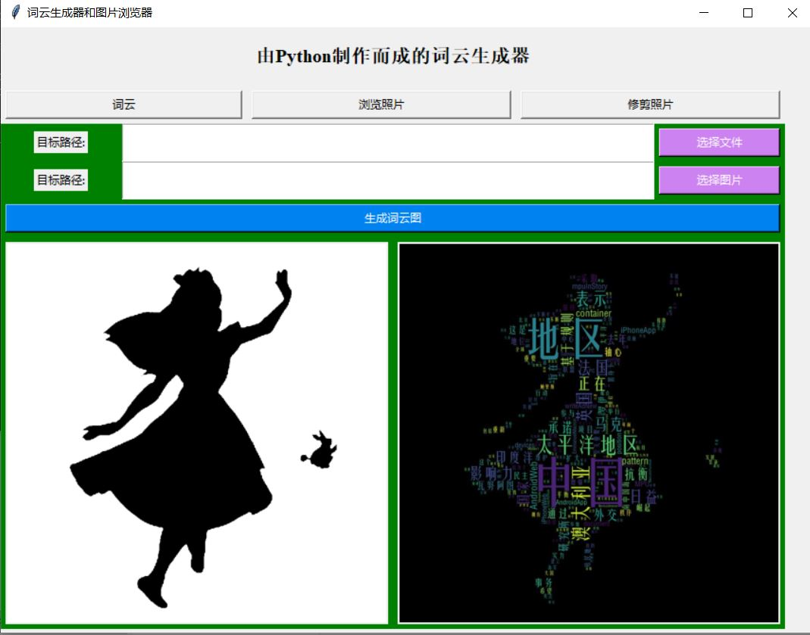
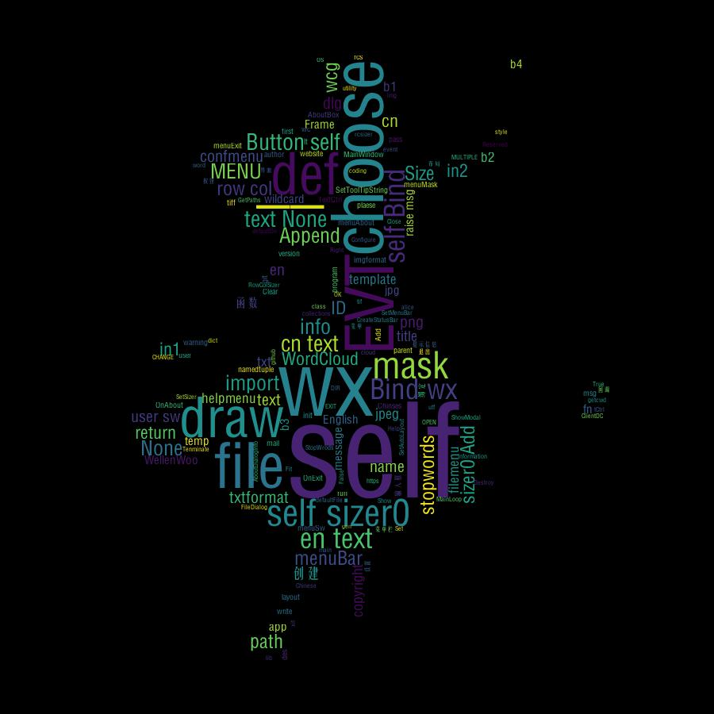

# 词云生成器
[English](./README_en.md) | 简体中文

## 简介

> 这是一个Python 实现的、带界面的词云生成器。
>
> 词云生成器：选择文档（中文、英文均可)和背景图片即可生成词云
>
> 图片浏览器，选择指定目录浏览图片

## 运行效果


## 运行环境：
- Python 3.8
- jieba 0.42.1
- wordcloud 1.8.0
- numpy1.19
- pillow 8.1
- wxPython 4.0
- numpy 1.19.0


## 环境搭建

1. 下载项目代码

```bash
git clone https://github.com/JimyFengqi/drawWordcloud
cd drawWordcloud
```
或者
```bash
git clone https://gitee.com/jimmyfengqi/drawword-cloud
cd drawword-cloud
```
2. 进入目录安装依赖。
```bash
source install.sh
```
或者仅仅使用pip安装
```bash
pip install -r requirements.txt
```
3.快速启动
```sh
python src/daw_gui
```
或者（下面命令实用于使用poetry安装依赖项）
```
test-package
```

效果如图：





## 项目配置
### 使用peotry管理整个工程
#### 添加项目入口
注意格式, test-package是最后生成的项目名字（自定义）

后面是真正的项目启动入口
注意项目名字错误，可能导致项目入口不能生成对应的执行文件
```
[tool.poetry.scripts]
  test-package = "src.test:GUI"
```
#### 添加镜像源
为了使poetry安装依赖文件比较顺利，我们加入配置项，使其使用国内镜像源安装
```
[[tool.poetry.source]]
    name = "tsinghua"
    url = "https://mirrors.tuna.tsinghua.edu.cn/pypi/web/simple/"
    default = true
```

### 添加代码检查工具
代码结构需要遵循[flake8](https://pypi.org/project/flake8/) 和[black](https://pypi.org/project/black/) 并通过[pre-commit-hook](https://github.com/pre-commit/pre-commit-hooks) 强制执行。

每行最长字符配置为120个字符。
```
[tool.black]
    line-length = 120
```

为了保持导入文件符合代码标准，我们使用 [isort](https://pypi.org/project/isort/) 这也是使用 [pre-commit-hook](https://github.com/pre-commit/pre-commit-hooks) 强制执行的

isort会把import分成标准库、第三方库、本地库三种，分别按字母排序。

格式化的结果，能自动满足Pylint的需要。
```
[tool.isort]
    profile = "black"
    line_length = 120
    multi_line_output = 3
    include_trailing_comma = true
```

代码提交前会进行代码检查，因为我们安装的有 [pre-commit](https://pypi.org/project/pre-commit) 工具，

和配置文件.pre-commit-config.yaml配合起来进行代码检查

如果需要跳过这些 hooks的检查，可以运行
```
git commit --no-verify
git push --no-verify
```
