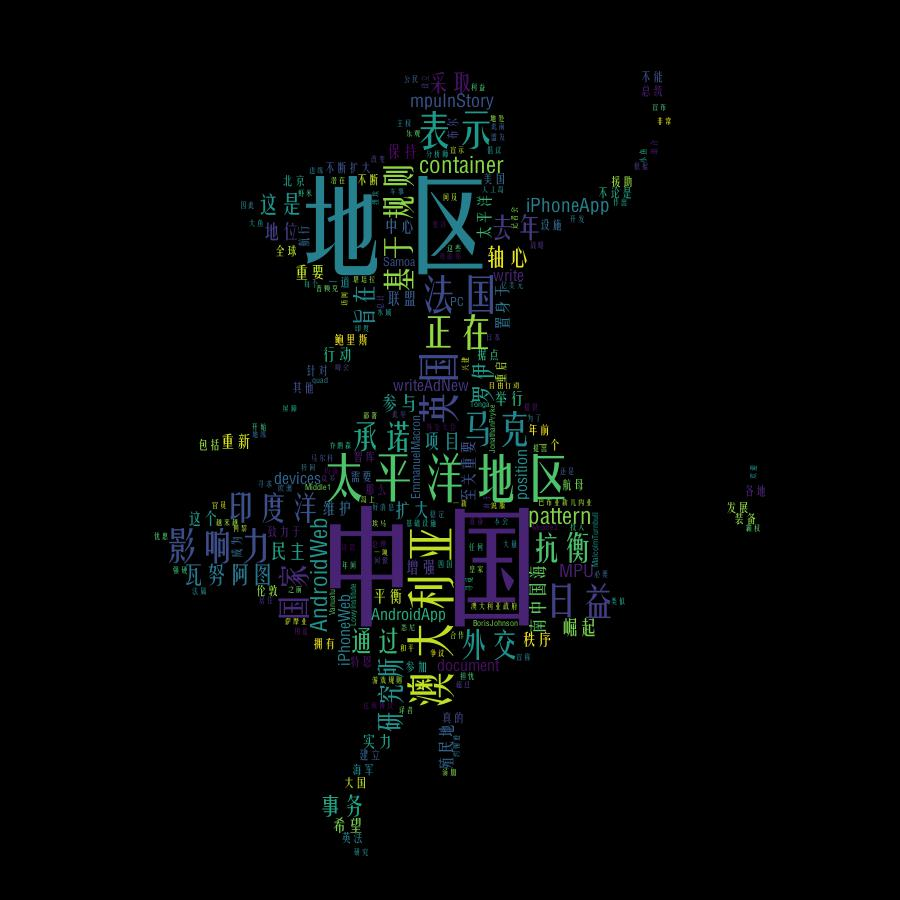
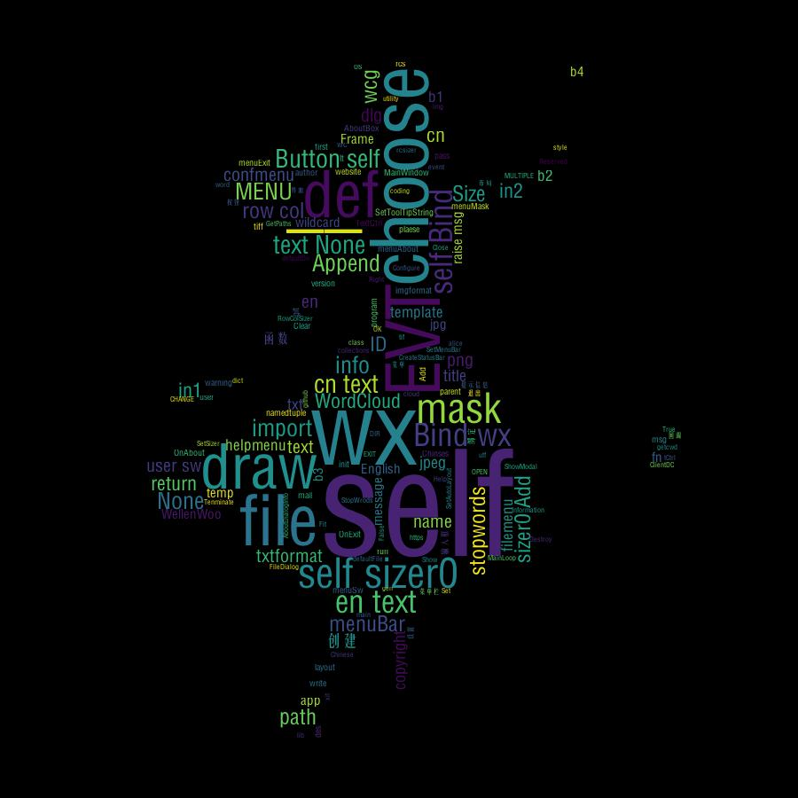

# **wordcloud_draw 词云生成器**

0. Python 实现的、带GUI界面的词云生成器。
选择文档后可以直接生成词云。

#运行环境：
python2.7 + jieba + wordcloud + numpy1.11 +PIL1.1.7 +wxPython2.8
或
python3.6 + jieba0.42 + wordcloud1.8 + numpy1.19 + PIL8.1 + wxPython4.0
效果如图：

